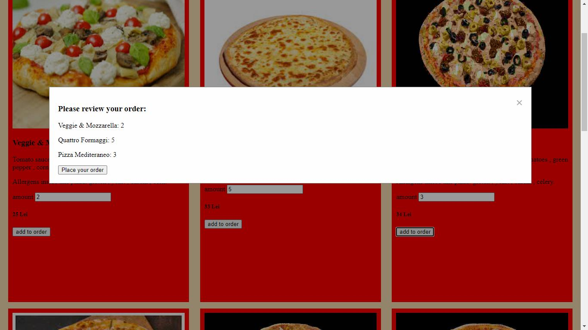

# Pizza Order Prototype

The Pizza Order Prototype is a full-stack JavaScript application, engineered to streamline the pizza ordering process. It's built with Node Express on the backend, and HTML, CSS, and JavaScript on the frontend. The application leverages RESTful APIs to perform CRUD operations, culminating in a dynamic and user-friendly interface.

## Application Functionality

Clients are presented with a varied pizza menu for selection. Addressing diverse dietary needs, the application offers an allergen filtering feature. Pizzas containing specified allergens are omitted from the display, assisting clients in making informed choices.
Clients can order multiple quantities of a specific pizza type. When they're ready to proceed, clicking on the "Place your order" button dispatches their pizza selections and respective quantities to the backend. Simultaneously, a form for entering delivery details is activated, ensuring a seamless and efficient ordering process.

## Data Handling and Storage

On the backend, all order-related data are stored in a JSON file named 'orders'. This file holds crucial details such as pizza type, quantity ordered, and delivery information. With each new order, this file is updated, maintaining a precise record of all transactions.
Upon clicking "Place your order", the list of selected pizzas, along with respective quantities, is sent to the backend and stored in a JSON file named 'idPizzaOrders'. Here, each pizza's ID is noted alongside the quantity ordered.
Delivery details are added post-submission of the form delivery details, creating a comprehensive record of the order. Together with the timestamp marking the placement, this information is merged with the pizza list, constituting a new entry in the 'orders.json' file.

## Communication and API Usage

Throughout the application's runtime, various HTTP requests are initiated. GET requests fetch data such as the allergen and pizza lists from the backend. The placement of an order triggers a POST request, dispatching the pizza list to the backend. Submission of delivery details via the form initiates another POST request, merging this information with the pizza list along with a timestamp. This amalgamation forms a new entry in the 'orders.json' file, signifying order completion.
In conclusion, the Pizza Order Prototype is a compelling illustration of the efficiency and adaptability of Node Express, working in harmony with HTML, CSS, and JavaScript to deliver a seamless user experience. This project brings to light the power of RESTful service implementation in a full-stack JavaScript environment, showcasing not only effective client-server communication and skilled handling and organization of data, but also a user-centric design that ensures a streamlined and intuitive pizza ordering process.

### Screenshot:

Modal display collected orders ready to be placed:

